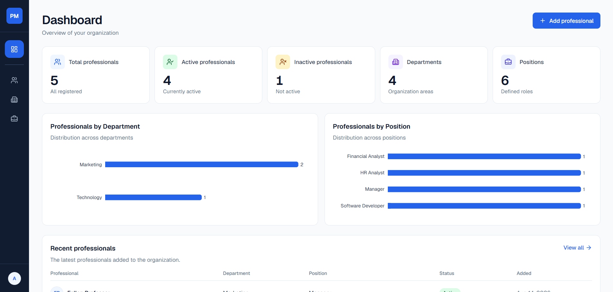

# Portfólio — Brayan Favarin

Portfólio profissional de Brayan Favarin, Desenvolvedor Full Stack. A aplicação
apresenta trajetória, tecnologias, experiências e estudos de caso em uma
interface dark editorial, responsiva e orientada a dados.

> Status: projeto pronto para execução local e validação de produção. O deploy
> depende da URL HTTPS definitiva, das variáveis do Resend e de proteção contra
> abuso no formulário.

## Destaques

- Homepage com Hero, Sobre, Projetos, Experiência, Tecnologias e Contato.
- Estudos de caso gerados dinamicamente a partir de `src/data/projects.ts`.
- Professional Management System como case principal, com frontend, backend,
  autenticação JWT, PostgreSQL, Docker e capturas reais.
- Formulário de contato acessível com validação compartilhada, honeypot e envio
  server-side por Resend.
- Currículo público disponível por configuração central.
- SEO com metadata, canonical, Open Graph, Twitter Card, sitemap, robots e
  ícone do App Router.
- Acessibilidade com skip link, foco visível, navegação por teclado e suporte a
  `prefers-reduced-motion`.

## Projeto em destaque



As capturas do Professional Management System ficam em
`public/images/projects/professional-management-system/` e são usadas pelo
card, Hero e galeria do estudo de caso.

## Stack

- Next.js 16 com App Router e React 19;
- TypeScript em modo estrito;
- Tailwind CSS 4 e tokens CSS;
- Motion para animações pontuais;
- Lucide React para ícones;
- Geist Sans e Geist Mono;
- Zod para validação;
- Resend para envio server-side do formulário;
- ESLint com Core Web Vitals.

## Requisitos

- Node.js 20.9 ou superior;
- npm.

## Instalação e execução local

1. Instale exatamente as dependências do lockfile:

   ```bash
   npm ci
   ```

   Para atualizar dependências de forma intencional durante o desenvolvimento,
   use `npm install`.

2. Copie o arquivo de ambiente:

   ```bash
   cp .env.example .env.local
   ```

   No Windows PowerShell:

   ```powershell
   Copy-Item .env.example .env.local
   ```

3. Inicie o ambiente local:

   ```bash
   npm run dev
   ```

4. Abra [http://localhost:3000](http://localhost:3000).

## Scripts

| Comando | Finalidade |
| --- | --- |
| `npm run dev` | Inicia o servidor de desenvolvimento. |
| `npm run lint` | Executa o ESLint. |
| `npx tsc --noEmit` | Verifica os tipos sem gerar JavaScript. |
| `npm run build` | Gera o build otimizado de produção. |
| `npm run start` | Serve localmente um build já gerado. |

O projeto ainda não possui suíte de testes automatizados. O workflow de
qualidade do GitHub executa lint, tipos e build a cada push e pull request.

## Variáveis de ambiente

Copie `.env.example` para `.env.local`. Nunca versione `.env.local` nem
valores reais de segredo.

```env
# URL pública, sem barra final. Em desenvolvimento, localhost é aceitável.
NEXT_PUBLIC_SITE_URL=http://localhost:3000

# Formulário de contato: somente server-side.
RESEND_API_KEY=
CONTACT_TO_EMAIL=
CONTACT_FROM_EMAIL=
```

### Formulário de contato e Resend

O formulário envia uma requisição para `POST /api/contact`. Nome, e-mail e
mensagem são validados no navegador e novamente no servidor. A API key não é
exposta ao cliente; o e-mail informado pelo visitante é usado apenas como
`replyTo`.

Para testar o envio real:

1. Crie uma API key na [Resend](https://resend.com/api-keys).
2. Preencha as três variáveis do Resend apenas em `.env.local`.
3. Use em `CONTACT_FROM_EMAIL` um remetente de domínio verificado na Resend.
4. Reinicie `npm run dev`, envie uma mensagem e confirme o recebimento.

Sem as variáveis obrigatórias, a rota falha de maneira controlada e o visitante
recebe uma mensagem genérica. O honeypot reduz spam básico; antes de um deploy
público, implemente rate limiting na plataforma de hospedagem ou na borda.

## Rotas

| Rota | Descrição |
| --- | --- |
| `/` | Homepage do portfólio. |
| `/projetos/professional-management-api` | Estudo de caso do Professional Management System. |
| `/projetos/portfolio-pessoal` | Estudo de caso do portfólio. |
| `/sitemap.xml` | Sitemap derivado dos projetos publicados. |
| `/robots.txt` | Regras de indexação. |

O ListaSmart permanece fora das rotas públicas enquanto não houver dados e
conteúdo de estudo de caso aprovados.

## Arquitetura

```text
public/
├── documents/                         # Currículo público
└── images/
    ├── og/                            # Arte Open Graph
    ├── profile/                       # Foto futura, quando habilitada
    └── projects/                      # Capturas dos projetos
src/
├── app/                               # Rotas, metadata, sitemap e robots
├── components/
│   ├── contact/                       # Formulário
│   ├── experience/                    # Timeline
│   ├── layout/                        # Navbar, Footer e Container
│   ├── projects/                      # Cards e estudos de caso
│   ├── sections/                      # Seções da homepage
│   ├── shared/                        # Elementos reutilizáveis
│   ├── technologies/                  # Grupos e itens de tecnologia
│   └── ui/                            # Botões
├── config/                            # Configuração pública central
├── data/                              # Conteúdo tipado
├── lib/                               # Schema, metadata e utilitários
└── types/                             # Contratos TypeScript
docs/                                  # Decisões, especificações e auditorias
```

Server Components são o padrão. Apenas Navbar, formulário e animações que
precisam de APIs do navegador são Client Components.

## Manutenção de conteúdo

### Dados pessoais e SEO

Atualize `src/config/site.ts` para alterar nome, cargo, localização, dados
sociais, e-mail público, descrição SEO, URL do site, currículo e imagem Open
Graph. Segredos nunca pertencem a esse arquivo.

Os textos de Hero e Sobre ficam em `src/data/personal.ts`. Contato,
experiências, tecnologias, navegação e redes sociais também possuem arquivos de
dados próprios em `src/data/`.

### Projetos e imagens

1. Adicione ou atualize o objeto tipado em `src/data/projects.ts`.
2. Use um `slug` único e preencha título, conteúdo do estudo de caso, stack e
   links somente quando existirem.
3. Adicione imagens em `public/images/projects/<slug>/`.
4. Atualize `image`, `imageAlt` e, se aplicável, a galeria no mesmo objeto.
5. Prefira WebP ou AVIF para novas imagens e mantenha proporções consistentes.

Cards, metadata, navegação entre projetos, rotas estáticas e sitemap derivam do
array de projetos. Não duplique slugs em outros arquivos.

O Professional Management System já usa capturas reais. O case do Portfólio
Pessoal usa temporariamente a arte Open Graph; substitua-a por capturas reais
quando elas estiverem disponíveis.

### Currículo

1. Mantenha o PDF em `public/documents/brayan-favarin-cv.pdf`.
2. Confirme `siteConfig.resume.path` como
   `/documents/brayan-favarin-cv.pdf`.
3. Mantenha `siteConfig.resume.enabled` como `true` apenas enquanto o PDF
   existir.

O botão **Baixar currículo** é exibido no Hero somente com a flag ativada.

## Preparação para deploy na Vercel

Nenhum deploy é executado por este repositório. Antes do primeiro deploy:

1. Confirme URLs públicas de GitHub, LinkedIn e e-mail em `src/config/site.ts`.
2. Defina `NEXT_PUBLIC_SITE_URL` com a origem HTTPS definitiva, sem caminho e
   sem barra final.
3. Configure `RESEND_API_KEY`, `CONTACT_TO_EMAIL` e `CONTACT_FROM_EMAIL`
   nas variáveis de ambiente da Vercel.
4. Use remetente ou domínio verificado na Resend.
5. Configure rate limiting para `POST /api/contact`.
6. Execute `npm run lint`, `npx tsc --noEmit` e `npm run build`.
7. Verifique sitemap, robots, metadata e imagem Open Graph após a publicação.

Não há necessidade de `vercel.json` para a configuração atual.

## Documentação

| Documento | Finalidade |
| --- | --- |
| [Project Blueprint](docs/project-blueprint.md) | Referência fundacional e histórica do projeto. |
| [Hero V2](docs/portfolio-v2-hero.md) | Especificação atual do Hero. |
| [Projetos V2](docs/portfolio-v2-projects-specification.md) | Especificação canônica de cards e estudos de caso. |
| [Decisões técnicas](docs/decisions.md) | Decisões arquiteturais que orientam a manutenção. |
| [Estado do projeto](docs/tasks.md) | Funcionalidades concluídas e próximos passos. |
| [Auditoria do repositório](docs/repository-audit.md) | Diagnóstico e acompanhamento da limpeza do repositório. |
| [Changelog](CHANGELOG.md) | Histórico oficial de mudanças. |

## Contato

Os canais públicos de contato são centralizados em `src/config/site.ts` e
renderizados no portfólio. Para propor melhorias no código, abra uma issue ou
pull request no repositório correspondente.
